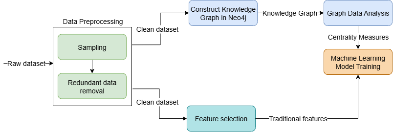

# 🧠 Credit Card Fraud Detection via Knowledge Graphs & Centrality-Based Features 💳🔍

This repository contains the full implementation of my **Bachelor Thesis Research** on enhancing Credit Card Fraud Detection (CCFD) through **graph-based analysis** and **machine learning**.

By modeling transactions as a **Knowledge Graph**, we extracted **centrality-based features**, including weighted variants, to enrich traditional feature sets. These were then fed into a variety of classifiers, including **XGBoost**, **Bagging**, and others, achieving state-of-the-art performance on a real-world dataset.

---

## 📘 Citation
If you use this code or research in your work, please cite:
   ```bash
   @InProceedings{BCIdimou2024,
   author="Dimou, George Konstantinos and Koloniari, Georgia",
   editor="B{\u{a}}dic{\u{a}}, Costin and Gu{\v{s}}ev, Marjan and Iftene, Adrian and Ivanovi{\'{c}}, Mirjana and Manolopoulos, Yannis and Xinogalos, Stelios",
   title="Enhancing Credit Card Fraud Detection Using Knowledge Graphs and Centralities",
   booktitle="Advances in ICT Research in the Balkans",
   year="2025",
   publisher="Springer Nature Switzerland",
   address="Cham",
   pages="14--29",
   abstract="Detecting fraudulent activity in credit card transactions poses a serious challenge for financial institutions, which requires robust techniques that can accurately pinpoint fraudulent occurrences           while minimizing false positives. In this study, we introduce an innovative strategy to enhance Credit Card Fraud Detection (CCFD) by utilizing Knowledge Graphs and Centrality measures. We propose
      creating a Knowledge Graph (KG) representing the credit card transaction network so as to capture connections and correlations between the transactions, and analyzing the KG to evaluate centrality
      measures that capture the importance of nodes and relationships within the graph. These centrality measures are utilized to enhance the input features that are used to train Machine Learning
      classifiers for fraud detection. Our experiments show that using the enhanced features significantly improved classification performance, providing better identification of fraudulent transactions,
      especially through the combination of HITS and degree centrality.",
      isbn="978-3-031-84093-7"
   }
   ```

## 📂 Repository Structure

| File/Folder | Description |
|-------------|-------------|
| `thesisTradML.ipynb` | Initial ML experiments without graph-based features (baseline). |
| `Main.py` | Main execution script for graph-enhanced experiments. Change `clfx` parameter on lines 128 & 131 to run different classifiers. |
| `Train_Test.py` | Contains all reusable ML training and evaluation functions. |
| `graph_utils/` | Utility functions for generating Knowledge Graphs, applying Neo4j queries, and computing centrality measures. |
| `data/` | Placeholder for datasets (not included in repo). |
| `results/` | Contains result logs, evaluation metrics, plots, and serialized models. |
| `assets/` | Visual assets such as pipeline diagrams and charts for documentation or publication. |

---

## 🚀 Quick Start

1. Clone the repository:
   ```bash
   git clone https://github.com/dimou-gk/KG-Fraud-Detection.git
   cd KG-Fraud-Detection

2. Install required dependencies:
   ```bash
   pip install -r requirements.txt

3. Make sure your Neo4j server is up and running, and update credentials in `graph_utils/neo4j_handler.py` accordingly.
4. Run the main script:
   ```bash
   python Main.py
Use the clfx parameter (e.g., clfx = "clf3") to select one of the following:
| String | Classifier |
|-------------|-------------|
   | `clf1` | Decision Tree |
   | `clf2` | Random Forest |
   | `clf3` | XGBoost |
   | `clf4` | K-NN |
   | `clf5` | Logistic Regression |
   | `clf6` | Naive Bayes |
   | `clf7` | Bagging |


## 📸 Project Pipeline Diagram




## Experimental Results

| Algorithm | Precision | Recall | F1-Score |
|-------------|-------------|-------------|-------------|
| `XGB (Baseline)` | 0.984 | 0.826 | 0.898 |
| `XGB (Eigen. + Degree)` | 0.988 | 0.842 | 0.91 |
| `XGB (Hits + Degree)` | **0.99** | **0.856** | **0.9**2 |


## 🔍 Highlights

- ✅ Knowledge Graph creation using Neo4j to model transaction relationships.
- 🧠 Centrality measures used as engineered features (weighted & unweighted).
- 📈 Significant performance gains in fraud detection with ensemble models.
- ⚖️ Addressed class imbalance using SMOTE oversampling.
- 📊 Demonstrated value of feature selection and graph topology in structured data.


## 🙏 Acknowledgements

This research was developed as part of my Bachelor’s Thesis and became my first academic publication. I am deeply grateful to:
- 👩‍🏫 Dr. Georgia Koloniari — for her continuous guidance, feedback, and support throughout the research process.


## 🔭 Future Work

- Integrate temporal graphs for time-aware fraud detection.
- Explore graph neural networks (GNNs) for automated feature learning.
- Implement real-time streaming with fraud prediction pipelines.


## 📬 Contact
Feel free to reach out with questions or suggestions
